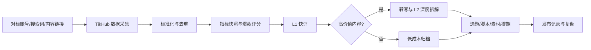
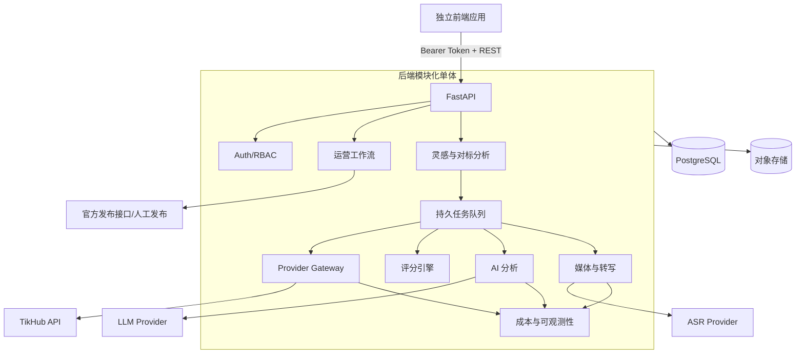
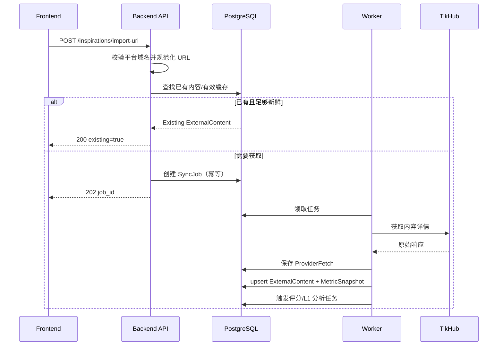

# Xuzhang · 社媒运营工作台：后端架构

状态：Draft v0.1  
适用阶段：内部单工作区 MVP，可平滑扩展到小团队  
数据源：TikHub（公开社媒数据）+ 人工导入 + 后续官方账号接口

## 1. 目标

后端负责把外部公开内容转成可搜索、可追踪、可分析、可进入生产流程的内部数据，并为独立前端提供稳定的 REST API。

后端必须完成以下闭环：



### 1.1 成功标准

- 前端不需要理解 TikHub 的字段和接口版本。
- 同一链接重复导入不会重复创建内容，也不会在新鲜度有效期内重复付费调用 TikHub。
- TikHub 暂时不可用时，已入库内容仍可浏览、搜索、分析和进入内容生产流程。
- 每次评分、AI 分析和指标变化都保留时间与证据，不覆盖历史。
- 所有高成本操作均可排队、限流、重试、取消并统计费用。
- 前后端只通过版本化 API 和 OpenAPI 契约通信。

## 2. 非目标

MVP 不负责：

- 自研抖音、小红书、B站爬虫或签名算法。
- 保存平台登录 Cookie。
- 未经人工确认的全自动发布。
- 永久下载并转载所有对标账号原视频。
- 一开始就做微服务、Kafka、Kubernetes 或复杂数据仓库。
- 用 AI 结果覆盖原始内容或把推断当作平台事实。

## 3. 架构原则

### 3.1 模块化单体

第一阶段采用一个代码库、三个运行进程：

1. `api`：REST API、鉴权、查询和业务写入。
2. `worker`：TikHub 调用、媒体处理、评分、AI、ASR。
3. `scheduler`：按策略创建同步、刷新和复盘任务。

三个进程共享 PostgreSQL 和对象存储。模块边界保持清晰，未来只有在负载或组织边界真实出现时才拆服务。

### 3.2 读写分离

- TikHub 属于外部公开数据的读取侧。
- 内容生产、排期和发布属于内部命令侧。
- TikHub 故障不能阻断选题、写稿或发布。
- 自动发布后续通过独立 `PublishingProvider` 接官方接口，不放进 TikHub Adapter。

### 3.3 供应商隔离

业务层只认识统一领域模型：

- `TrackedProfile`
- `ExternalContent`
- `MetricSnapshot`
- `CommentSample`

TikHub 原始响应只能通过 `ProviderAdapter` 转换后进入业务层。

### 3.4 原始事实与派生结果分开

数据分三层保存：

1. `ProviderFetch`：TikHub 原始响应和调用证据。
2. 标准化实体：账号、内容、指标、评论。
3. 派生结果：爆款评分、逐字稿、AI 分析、选题建议。

派生结果可以重新生成；原始事实不可被 AI 输出覆盖。

## 4. 推荐技术栈

| 层 | 选择 | 说明 |
|---|---|---|
| API | Python + FastAPI | 与 TikHub SDK、AI、ASR 生态一致，自动生成 OpenAPI |
| ORM | SQLAlchemy 2 | 明确事务边界，适合 API 与 Worker 共用 |
| 数据库迁移 | Alembic | 所有 Schema 变化进入版本控制 |
| 数据库 | PostgreSQL 16+ | 事务、JSONB、全文搜索、可靠任务领取 |
| 任务队列 | PostgreSQL 持久任务表 | MVP 无需额外消息中间件，使用 `SKIP LOCKED` 领取 |
| 缓存/分布式限流 | Redis，可选 | 单 Worker 阶段不必部署；横向扩容时启用 |
| 对象存储 | S3 兼容存储 | 原始响应、封面、逐字稿附件和用户素材 |
| 搜索 | PostgreSQL FTS + `pg_trgm` | 先满足标题、正文、作者、标签搜索 |
| 向量检索 | `pgvector`，P2 | 仅在语义检索确有价值后启用 |
| API 契约 | OpenAPI 3 | 前端生成 TypeScript Client，减少手写类型漂移 |

所有时间写入 UTC；前端按工作区时区显示。

## 5. 系统边界



## 6. 后端模块

### 6.1 Identity

负责：

- 用户身份。
- 工作区。
- 工作区成员关系。
- `owner`、`editor`、`viewer` 三种角色。
- 服务端 Worker Token 与用户访问令牌分离。

### 6.2 Owned Channels

负责我们自己运营的账号：

- 平台与账号标识。
- 定位、目标受众、内容支柱。
- 语言、语气、禁区和合规提示。
- 发布方式：人工、官方 API 或未接入。

不得与对标账号共用一张业务表。

### 6.3 Tracked Profiles

负责对标账号：

- TikHub/平台账号 ID。
- 昵称、粉丝数和公开简介。
- 监控开关、优先级和扫描频率。
- 平台分页游标。
- 最近成功同步时间和错误状态。

### 6.4 Inspiration

负责外部公开内容与工作区收藏关系：

- 外部内容标准化。
- URL 导入。
- 标签、分类和人工备注。
- 搜索结果候选。
- 从灵感转成选题。

同一外部内容在工作区中只保留一份标准化实体，可以拥有多条指标快照和分析版本。

### 6.5 Provider Gateway

负责：

- TikHub 鉴权。
- 平台能力注册。
- endpoint 版本映射。
- 超时、重试、限流和熔断。
- 请求去重与新鲜度判断。
- 原始响应保存。
- 请求成本记录。

详细规范见 [TikHub 集成](./tikhub-integration.md)。

### 6.6 Scoring

负责：

- 平台核心指标计算。
- 账号历史基线。
- `R`、`M`、`Tier` 和等级。
- 首次评级证据冻结。
- 评分策略版本化。
- 后续指标增长重算，但不篡改首次判定证据。

### 6.7 Analysis

负责两级 AI：

- L1：低成本结构化快评。
- L2：只针对高价值内容做深度拆解。
- Prompt 与模型版本记录。
- 输入 Hash 去重。
- JSON Schema 校验。
- 来源证据引用。

所有外部正文、评论和逐字稿都被视为不可信数据，不能作为系统指令执行。

### 6.8 Transcript & Media

负责：

- 封面代理与 WebP 缓存。
- 视频/音频临时下载。
- ASR 任务。
- 逐字稿与时间轴。
- 下载文件生命周期清理。
- MIME、大小和域名白名单验证。

默认只永久保存封面、逐字稿和用户主动选择的素材，不永久保存所有对标视频。

### 6.9 Content Workflow

负责：

- 选题。
- 内容项目。
- 脚本版本。
- 素材。
- 审核。
- 排期。
- 发布包。
- 发布记录。
- 24 小时、7 天、30 天复盘。

内容项目状态：

```text
idea
→ scripting
→ producing
→ review
→ scheduled
→ published
→ reviewing
→ archived
```

状态跳转由后端校验，前端不能任意修改。

### 6.10 Cost & Observability

负责：

- TikHub 每日请求和费用。
- LLM Token 与费用。
- ASR 时长与费用。
- 每日、每工作区预算。
- 队列积压。
- endpoint 错误率与熔断状态。
- 任务审计。

## 7. 关键数据流

### 7.1 导入单条链接



### 7.2 扫描对标账号

1. Scheduler 根据 `next_scan_at` 创建 `PROFILE_SCAN`。
2. Worker 获取作品列表摘要并保存分页游标。
3. 以 `(workspace_id, platform, external_id)` 去重。
4. 新作品先保存摘要，不立即获取全部评论。
5. 满足热度、时间或人工选择条件时，再执行详情 Hydration。
6. 评分达到门槛后创建 L1。
7. L1 决定是否创建转写与 L2。

### 7.3 内容指标刷新

- 内容正文与发布时间低频校验。
- 指标以追加快照保存。
- 发布 3 天内可每 6–12 小时刷新。
- 发布 4–14 天每天刷新。
- 更旧内容每周刷新或停止。
- 每个刷新策略都受工作区预算控制。

## 8. 任务队列

PostgreSQL 是任务事实来源。Worker 使用短事务和 `FOR UPDATE SKIP LOCKED` 领取任务。

任务状态：

```text
pending
→ running
→ succeeded

running
→ retry_wait
→ pending

running
→ failed
→ dead

pending/retry_wait
→ cancelled
```

每个任务必须包含：

- `workspace_id`
- `job_type`
- `dedupe_key`
- `priority`
- `payload`
- `status`
- `attempt`
- `max_attempts`
- `run_after`
- `locked_at`
- `locked_by`
- `last_error_code`
- `last_error_message`
- `created_at`
- `finished_at`

唯一活跃 `dedupe_key` 防止同一账号、作品或分析任务被重复排队。

## 9. 爆款评分

### 9.1 基线

对候选作品 `p`，只使用它发布前该账号最近最多 20 条有效作品，避免未来数据泄漏：

```text
baseline(p) = median(core_metric(previous_20_posts))
R(p) = core_metric(p) / max(baseline(p), 1)
M(p) = reach_proxy(p) / max(follower_snapshot, 1)
```

`core_metric` 和 `reach_proxy` 由平台评分策略定义。小红书、抖音和 YouTube 不共享固定权重。

### 9.2 可评级条件

- 内容达到平台最小观察时长。
- 有足够历史样本；不足时标记 `insufficient_baseline`。
- 粉丝快照存在。
- 指标字段可靠。

### 9.3 证据冻结

首次评级时保存：

- 评分策略版本。
- 粉丝快照。
- 基线样本内容 ID。
- 基线中位数。
- 当时指标。
- `R`、`M`、`Tier` 和 Grade。
- 评级时间。

阈值做成数据库配置，不能硬编码在前端。

## 10. AI 分析

> 交互架构（官方定价目录、熔断/限流/幂等、worker 解耦）见
> [AI 交互架构](./ai-architecture.md)。

### 10.1 L1 输出

严格 JSON：

- `summary`
- `factors[]`
- `confidence`
- `caveats[]`
- `life`: `timely | evergreen`
- `life_reason`
- `recommended_for_l2`

### 10.2 L2 输出

- 钩子。
- 内容结构。
- 受众痛点。
- 情绪或利益触发点。
- 可复制模式。
- 不可复制背景。
- 可转成的选题。
- 推荐自有账号。
- 风险和事实核查项。
- 引用的内容、评论或逐字稿片段 ID。

### 10.3 去重与重跑

```text
input_hash = hash(
  content_version
  + transcript_version
  + prompt_version
  + model
  + analysis_level
)
```

相同 `input_hash` 的成功分析直接复用。模型或 Prompt 更新时允许显式重跑并保留旧版本。

## 11. API 约束

- 基础路径：`/api/v1`
- JSON 使用 `snake_case`。
- ID 使用 UUID。
- 时间使用 ISO 8601 UTC。
- 列表使用 Cursor Pagination。
- 异步操作返回 `202 Accepted + job_id`。
- 写操作支持 `Idempotency-Key`。
- 脚本和选题编辑使用版本号进行乐观锁。
- 错误采用 `application/problem+json`。

详细接口见 [API 契约](./api-contract.md)。

## 12. 后端目录建议

```text
backend/
├── pyproject.toml
├── alembic.ini
├── app/
│   ├── main.py
│   ├── api/
│   │   ├── dependencies.py
│   │   └── v1/
│   ├── core/
│   │   ├── config.py
│   │   ├── auth.py
│   │   ├── errors.py
│   │   └── telemetry.py
│   ├── db/
│   │   ├── session.py
│   │   ├── models/
│   │   └── migrations/
│   ├── modules/
│   │   ├── identity/
│   │   ├── channels/
│   │   ├── tracked_profiles/
│   │   ├── inspirations/
│   │   ├── scoring/
│   │   ├── analysis/
│   │   ├── transcripts/
│   │   ├── content_workflow/
│   │   └── reviews/
│   ├── providers/
│   │   ├── social/
│   │   │   ├── base.py
│   │   │   └── tikhub/
│   │   ├── llm/
│   │   ├── asr/
│   │   ├── storage/
│   │   └── publishing/
│   ├── jobs/
│   │   ├── scheduler.py
│   │   ├── worker.py
│   │   ├── registry.py
│   │   └── handlers/
│   └── schemas/
├── tests/
│   ├── unit/
│   ├── integration/
│   ├── contract/
│   └── fixtures/
└── docker/
```

模块之间通过服务接口调用，不允许跨模块直接操作对方的数据表。

## 13. 交付阶段

### P0：数据内核

- TikHub Adapter。
- 链接导入。
- 对标账号扫描。
- 标准化、去重和快照。
- 持久任务队列。
- 成本记录。

### P1：判断与分析

- 评分策略。
- 证据冻结。
- L1。
- 转写。
- L2。
- 搜索和灵感库 API。

### P2：生产工作流

- 选题。
- 脚本版本。
- 素材。
- 审核与排期。
- 人工发布包。
- 发布后数据与复盘。

### P3：增强能力

- 官方发布接口。
- 团队权限深化。
- 语义搜索。
- 多供应商容灾。
- 更细的运营实验与转化归因。

## 14. 关联文档

- [数据模型](./data-model.md)
- [API 契约](./api-contract.md)
- [TikHub 集成](./tikhub-integration.md)
- [运行、部署与验收](./operations.md)
- [TikHub API 文档](https://docs.tikhub.io/)
- [TikHub 小红书接口说明](https://tikhub.io/xiaohongshu-api)
- [TikHub 价格](https://tikhub.io/pricing)
