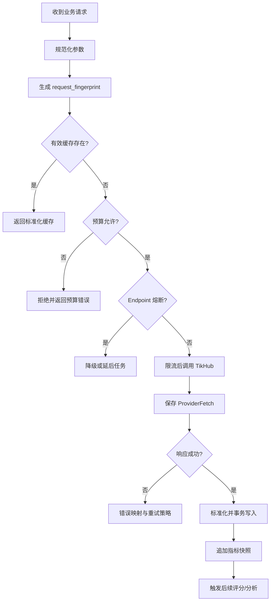

# TikHub 集成规范

TikHub 是外部公开数据供应商，不是本系统的数据模型、任务队列或发布系统。

## 1. 设计目标

- 一把 API Key 支持多个平台。
- TikHub 字段和版本变化被限制在 Adapter 内。
- 避免重复请求和无效费用。
- 支持 endpoint 降级和版本迁移。
- 保存足够的原始响应用于排障和重新标准化。
- TikHub 不可用时，业务系统可降级运行。

## 2. Provider 接口

```python
class SocialDataProvider(Protocol):
    async def resolve_url(self, url: str) -> ExternalReference: ...
    async def fetch_profile(self, ref: ExternalReference) -> ProviderResult: ...
    async def fetch_profile_contents(
        self,
        ref: ExternalReference,
        cursor: str | None,
        limit: int,
    ) -> ProviderPage: ...
    async def fetch_content(self, ref: ExternalReference) -> ProviderResult: ...
    async def fetch_metrics(self, ref: ExternalReference) -> ProviderResult: ...
    async def fetch_comments(
        self,
        ref: ExternalReference,
        cursor: str | None,
        limit: int,
    ) -> ProviderPage: ...
    async def search(
        self,
        platform: str,
        query: str,
        cursor: str | None,
        limit: int,
    ) -> ProviderPage: ...
    async def fetch_trending(self, platform: str) -> ProviderResult: ...
```

业务模块只能依赖该接口及标准化 DTO，不能 import TikHub SDK 类型。

## 3. Adapter 分层

```text
TikHubHttpClient
    ↓ HTTP、鉴权、超时、重试
TikHubEndpointRegistry
    ↓ 平台能力和版本映射
TikHubResponseParser
    ↓ 响应校验、错误映射
TikHubNormalizer
    ↓ 统一领域 DTO
ProviderGateway
    ↓ 缓存、预算、熔断、审计
Business Modules
```

### 3.1 Endpoint Registry

不能把 TikHub 路径散落在业务代码里。使用内部稳定别名：

```yaml
xiaohongshu:
  content_detail:
    endpoint_key: xhs.content_detail
    series: app_v2
  profile_contents:
    endpoint_key: xhs.profile_contents
    series: app_v2
  search:
    endpoint_key: xhs.search
    series: app_v2
  trending:
    endpoint_key: xhs.trending
    series: web_v3
```

Registry 至少记录：

- 内部能力名。
- TikHub 路径。
- HTTP 方法。
- 参数 Schema。
- 当前版本。
- 备用版本。
- 单次预估价格。
- 限速。
- 默认超时。
- 缓存新鲜度。
- 是否支持批量。
- 是否启用。

TikHub 当前建议小红书内容使用 App V2，热榜/首页等补充能力使用 Web V3；旧 App V1、Web、Web V2 不作为新系统依赖。

## 4. 请求生命周期



## 5. 请求指纹与缓存

请求指纹必须基于：

```text
provider
endpoint_key
endpoint_version
normalized_params
workspace_scope_if_required
```

禁止包含：

- API Key。
- Authorization Header。
- 不影响结果的分页默认值差异。
- 参数顺序。

建议新鲜度：

| 能力 | 默认新鲜度 |
|---|---:|
| 内容详情 | 24 小时 |
| 账号信息 | 24 小时 |
| 账号作品第一页 | 1–6 小时 |
| 搜索结果 | 1 小时 |
| 热榜 | 1 小时 |
| 评论页 | 24 小时 |
| 已发布 3 天内指标 | 6–12 小时 |
| 4–14 天内容指标 | 24 小时 |
| 更旧内容指标 | 7 天 |

缓存命中指我方数据库/对象存储，不依赖 TikHub 的 `cache_url`。TikHub 的重复实时请求仍会独立计费。

## 6. 渐进式 Hydration

数据分四级：

```text
summary → detail → comments → transcript
```

### `summary`

来自账号作品列表或搜索：

- 内容 ID。
- 标题/描述摘要。
- 作者。
- 发布时间。
- 基础指标。
- 封面地址。

### `detail`

只有以下情况获取：

- 用户打开并收藏。
- 摘要指标达到阈值。
- 进入评分候选。
- 工作区明确设置全量详情。

### `comments`

只有以下情况获取：

- 内容进入候选选题。
- 需要受众痛点或舆情分析。
- 用户手动请求。

默认取高赞和前若干页，不无限抓取。

### `transcript`

只有 L1 推荐或用户手动选择后执行。

小红书详情目前按单条请求计费且没有批量详情能力，因此渐进式 Hydration 是成本控制的必要部分。

## 7. 分页与增量同步

每个平台保存独立 Cursor：

```json
{
  "series": "app_v2",
  "cursor": "...",
  "last_seen_external_id": "...",
  "last_seen_published_at": "...",
  "updated_at": "..."
}
```

账号同步规则：

1. 第一页始终优先。
2. 遇到已知内容且发布时间早于上次成功同步边界时，可提前停止。
3. 初次回填允许配置 `max_pages`。
4. 日常同步不默认重扫全部历史。
5. 同一内容的列表摘要和详情通过外部 ID 合并。
6. Cursor 只有在本页事务成功后更新。

## 8. 超时、重试与熔断

### 8.1 默认超时

- 连接超时：10 秒。
- 总请求超时：45 秒。
- 大型结果可按 endpoint 放宽，但不得无限等待。

### 8.2 错误分类

| 情况 | 动作 |
|---|---|
| 401/403 | 不重试，暂停 Provider 并报警 |
| 402 | 不重试，标记余额/权限问题 |
| 404 内容不存在 | 标记来源不可见，不重试 |
| 422 参数错误 | 不重试，记录 Adapter 缺陷 |
| 429 | 指数退避 + 抖动 |
| 5xx/网络超时 | 最多 3 次重试 |
| 小红书持续 400 | 不热循环；延后 30–60 分钟 |
| Schema 不兼容 | 保存原始响应，停止该 endpoint 并报警 |

### 8.3 熔断

按 `endpoint_key` 独立统计：

- 连续失败达到阈值后打开熔断。
- 熔断期间不产生重复费用。
- 半开状态只允许少量探测。
- endpoint 恢复后自动关闭。
- 备用版本只有经过契约测试后才能切换。

## 9. 限流

TikHub 文档给出的默认限制为每个 endpoint 10 RPS。内部限制应更保守：

- 默认 5 RPS/endpoint。
- 小红书默认 2 RPS/endpoint。
- 单 Worker 时使用进程内 Token Bucket。
- 多 Worker 时切换 Redis 分布式 Token Bucket。
- 用户手动任务与后台回填分别设置优先级。

限流必须在请求发出前执行，不能依赖收到 429 后再控制。

## 10. 费用控制

### 10.1 预算层级

- 系统每日上限。
- 工作区每日上限。
- endpoint 每日上限。
- 单次批量任务预估上限。
- AI 和 ASR 使用独立预算，不与 TikHub 混算。

### 10.2 调用前预估

批量任务创建前计算：

```text
estimated_cost =
  expected_list_requests
  + expected_detail_requests
  + expected_comment_requests
```

TikHub 提供 endpoint 信息和价格计算能力，可定期同步价格目录。运行时仍保存价格快照，避免供应商价格变化后无法解释历史成本。

### 10.3 费用降级顺序

接近预算时依次关闭：

1. 旧内容指标刷新。
2. 评论深分页。
3. 低优先级账号扫描。
4. 搜索结果详情 Hydration。
5. 仅保留高优先级账号第一页扫描。

用户手动强制请求需明确展示预估成本，并受硬预算保护。

## 11. 标准化

### 11.1 内容

统一 DTO：

```json
{
  "platform": "xiaohongshu",
  "external_id": "string",
  "canonical_url": "https://...",
  "content_type": "image_text",
  "title": "string",
  "body_text": "string",
  "published_at": "2026-07-30T00:00:00Z",
  "duration_ms": null,
  "author": {
    "external_id": "string",
    "display_name": "string",
    "handle": "string",
    "followers": 10000
  },
  "metrics": {
    "views": null,
    "likes": 100,
    "comments": 20,
    "favorites": 80,
    "shares": 5
  },
  "media": [],
  "provider_metadata": {
    "provider": "tikhub",
    "endpoint_key": "xhs.content_detail",
    "provider_request_id": "string"
  }
}
```

平台不提供的指标必须为 `null`，不能填 `0`。例如小红书未公开播放量时，`views=null`。

### 11.2 数值

- `"1.2万"` 等展示值必须解析为整数，同时保留原始字段于 ProviderFetch。
- 超出类型范围或不可信数值设为 `null` 并记录解析警告。
- 列表摘要与详情冲突时，保留两个 ProviderFetch，以更新时间和能力等级决定当前值。

### 11.3 时间

- 优先使用平台时间戳。
- TikHub 响应时区仅用于解释供应商元数据。
- 无法确认时区时不得假定本地时间。

## 12. 原始响应

- 响应小于阈值时可压缩后保存对象存储。
- 数据库只保存去敏摘要和对象 Key。
- 原始响应不得包含 API Key、完整 Authorization Header。
- 保存响应 Schema 版本和解析器版本。
- 解析失败仍保存原始响应，以便修复 Parser 后重放。

## 13. 媒体

- TikHub 返回的媒体 URL 可能过期或有防盗链。
- 前端不得直接依赖媒体 URL。
- 后端媒体代理只允许已登记来源域名。
- 校验 Content-Type、文件头、大小和重定向目标。
- 封面转换为 WebP 后保存。
- 原视频只为转写临时下载，默认完成后删除。
- 不得把“可下载”解释为拥有再发布授权。

## 14. 安全与合规边界

- 只处理公开可访问内容。
- 不保存平台登录 Cookie。
- 不尝试绕过私密内容或权限。
- 评论作者信息最小化保存。
- 支持按来源 URL、作者或内容 ID 执行删除。
- 对来源已删除内容停止刷新并隐藏媒体。
- 对外展示和再发布前必须检查素材权利。
- API Key 只存在服务端 Secret Store。

## 15. 契约测试

每个启用 endpoint 都需要固定的去敏 Fixture 和契约测试：

- 成功响应。
- 字段缺失。
- 空列表。
- 内容已删除。
- 429。
- 5xx。
- Schema 变化。
- 分页 Cursor。
- 数值和时间标准化。

每日可对少量固定公开样本执行 Smoke Test，但必须计入预算且不得依赖单一内容永远存在。

## 16. 参考

- [TikHub API 文档](https://docs.tikhub.io/)
- [TikHub 小红书接口说明](https://tikhub.io/xiaohongshu-api)
- [TikHub 价格说明](https://tikhub.io/pricing)

