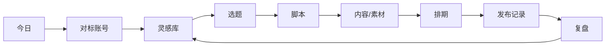
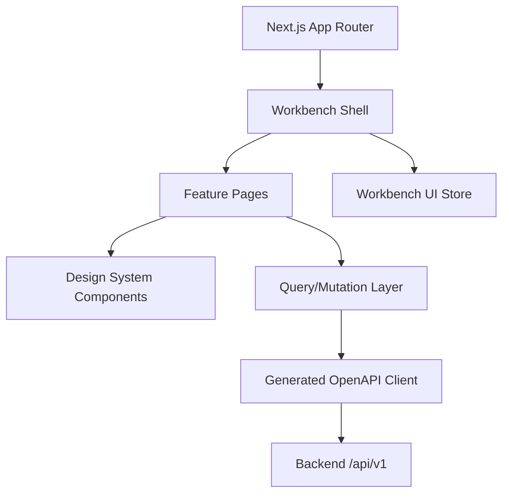

# 社媒运营工作台：前端架构

状态：Draft v0.1  
适用阶段：后端 P0 已启动，前端从 P0 Shell 和对标账号页面开始  
后端契约：[后端 API 契约](../backend/api-contract.md)

## 1. 目标

前端是一个桌面优先的社媒运营工作台，负责把采集、判断、内容生产、排期和复盘呈现为一条清晰的操作流水线。



前端成功标准：

- 用户在 3 次点击内从灵感进入选题或脚本。
- 所有 TikHub、AI、转写等异步操作都有可见状态、费用提示和失败恢复入口。
- URL 可以独立打开、刷新和分享；顶部工作台标签不取代路由。
- 前端不认识 TikHub 原始字段，只使用后端 OpenAPI DTO。
- 列表筛选可以通过 URL 恢复，刷新页面不会丢失。
- 同一业务对象在多页面展示时使用一致状态、颜色和术语。
- 桌面端优先，同时保证平板可用和移动端基本查看能力。

## 2. 非目标

第一阶段不做：

- 浏览器直接调用 TikHub。
- 在前端保存 TikHub API Key、LLM Key 或平台 Cookie。
- 前端实现爆款评分、费用计算或状态机业务规则。
- 未经后端确认的乐观“发布成功”。
- 复杂离线编辑或完整 PWA。
- 一开始支持任意布局拖拽和高度可配置 Dashboard。
- 为移动端复刻全部桌面生产能力。

## 3. 架构原则

### 3.1 前后端严格分离

- 前端独立构建和部署。
- 后端是业务事实来源。
- REST 基础路径 `/api/v1`。
- OpenAPI 生成 TypeScript 类型与 Client。
- 禁止在页面组件中散落手写 `fetch`。
- 后端错误码由统一错误层转换成人类可理解的提示。

### 3.2 Server State 与 UI State 分开

| 状态 | 所有者 | 示例 |
|---|---|---|
| Server State | TanStack Query | 对标账号、灵感、任务、选题、排期 |
| URL State | Next.js Router | 搜索词、筛选、排序、分页游标 |
| Form State | 表单组件 | 新建账号、修改定位、脚本编辑 |
| Workbench State | 小型前端 Store | 已打开标签、侧边栏状态、最近工作区 |
| Ephemeral State | React 局部状态 | 弹窗、Popover、Hover、临时选择 |

不得把后端实体复制进全局 Store 形成第二份缓存。

### 3.3 URL 是页面事实来源

顶部标签模拟桌面工作台，但标签内容必须对应真实 URL。

例如：

```text
/w/{workspace_id}/inspirations
/w/{workspace_id}/inspirations/{inspiration_id}
/w/{workspace_id}/content-projects/{project_id}/script
```

浏览器刷新、前进、后退和复制链接都应正常工作。

### 3.4 异步优先

以下操作不会使用阻塞式等待：

- TikHub 内容导入。
- 对标账号同步。
- 搜索和热榜刷新。
- 评论抓取。
- 转写。
- L1/L2 分析。
- AI 脚本生成。
- 发布包生成。

创建任务后立即展示 Job，并由任务中心追踪。

## 4. 技术栈

| 层 | 选择 | 说明 |
|---|---|---|
| Framework | Next.js 16 App Router | 路由、布局、代码分割和独立部署 |
| UI | React 19 + TypeScript strict | 强类型组件和交互 |
| Styling | Tailwind CSS v4 | 使用 CSS-first `@theme` 管理 Design Tokens |
| Server State | TanStack Query v5 | 缓存、Mutation、失效和异步任务轮询 |
| Forms | React Hook Form + Schema 校验 | 统一表单状态和错误展示 |
| API Client | OpenAPI 生成 | 与后端 DTO 和错误码同步 |
| UI Store | 小型 Zustand Store | 仅保存工作台标签和界面偏好 |
| Table | Headless Table | 大列表的排序、选择和列配置 |
| Unit Tests | Vitest + Testing Library | 组件、Hook 和纯函数 |
| E2E | Playwright | 核心业务流程 |
| API Mock | MSW | 基于契约的本地开发与错误场景 |

Next.js App Router 默认使用 Server Components；交互、浏览器 API、TanStack Query Provider 和工作台 Store 放在明确的 Client Component 边界内。工作台页面高度交互且使用浏览器中的访问令牌，因此业务列表主要由 Client Component 使用生成 Client 读取，布局和静态壳层继续使用 Server Component。

## 5. 高层结构



## 6. 前端运行边界

### 6.1 Server Components

适合：

- Root Layout。
- 字体、Metadata 和全局 CSS。
- 登录页静态结构。
- 不依赖浏览器令牌的静态帮助页。
- 页面级 Loading/Suspense 外壳。

### 6.2 Client Components

适合：

- TanStack Query Provider。
- 登录状态。
- 工作区切换。
- 多标签栏。
- Command Palette。
- 所有可编辑表单。
- 数据表、筛选、批量选择。
- Job 轮询和通知。
- 日历和拖拽交互。

`"use client"` 应尽量靠近交互叶节点，不把整个应用无差别变成 Client Component。

## 7. 应用 Shell

```text
┌──────────────────────────────────────────────────────────────┐
│ Workbench Tabs                         Command / User / Jobs │
├──────────────┬───────────────────────────────────────────────┤
│ Workspace    │ Page Header                                   │
│ Sidebar      │                                               │
│              │ Page Content                                  │
│ Navigation   │                                               │
│              │                                               │
│ System       │                                               │
└──────────────┴───────────────────────────────────────────────┘
```

Shell 固定包含：

- 工作区切换器。
- 连接/后端状态。
- 左侧业务导航。
- 顶部工作台标签。
- 全局搜索/命令面板。
- Job Center。
- 用户与设置菜单。

页面不重复实现 Shell。

## 8. 推荐目录

```text
frontend/
├── package.json
├── next.config.ts
├── tsconfig.json
├── public/
├── src/
│   ├── app/
│   │   ├── layout.tsx
│   │   ├── providers.tsx
│   │   ├── (auth)/
│   │   │   └── login/
│   │   └── (workbench)/
│   │       └── w/
│   │           └── [workspace_id]/
│   │               ├── layout.tsx
│   │               ├── today/
│   │               ├── channels/
│   │               ├── tracked-profiles/
│   │               ├── inspirations/
│   │               ├── topics/
│   │               ├── content-projects/
│   │               ├── schedule/
│   │               ├── reviews/
│   │               ├── patterns/
│   │               ├── assets/
│   │               ├── jobs/
│   │               └── settings/
│   ├── features/
│   │   ├── auth/
│   │   ├── workspaces/
│   │   ├── channels/
│   │   ├── tracked-profiles/
│   │   ├── inspirations/
│   │   ├── topics/
│   │   ├── content-projects/
│   │   ├── scripts/
│   │   ├── assets/
│   │   ├── schedule/
│   │   ├── reviews/
│   │   ├── jobs/
│   │   └── usage/
│   ├── components/
│   │   ├── ui/
│   │   ├── workbench/
│   │   ├── data-display/
│   │   ├── feedback/
│   │   └── forms/
│   ├── api/
│   │   ├── generated/
│   │   ├── client.ts
│   │   ├── errors.ts
│   │   └── query-keys.ts
│   ├── stores/
│   │   └── workbench-store.ts
│   ├── hooks/
│   ├── lib/
│   ├── styles/
│   │   └── globals.css
│   └── test/
│       ├── fixtures/
│       ├── handlers/
│       └── setup.ts
├── tests/
│   └── e2e/
└── scripts/
    └── generate-api-client.ts
```

路由目录只负责组合页面；业务逻辑和 Query Hook 放在 `features/`。

## 9. 分阶段交付

### Frontend P0：可运行 Shell

- 登录/开发身份。
- 工作区创建与切换。
- App Shell、侧边栏和顶部标签。
- 基础 Command Palette：页面跳转和新建对标账号。
- 对标账号列表、新建、编辑、暂停、恢复和同步。
- Job Center。
- 统一 Loading、Empty、Error、Forbidden。
- OpenAPI Client 和 Query Key 基础设施。

P0 只使用后端当前已实现的接口。

当前可直接联调的后端范围：

```text
GET  /api/v1/health/live
GET  /api/v1/health/ready
GET  /api/v1/me
GET  /api/v1/workspaces
POST /api/v1/workspaces
GET/POST/PATCH /api/v1/tracked-profiles
GET  /api/v1/tracked-profiles/{id}
POST /api/v1/tracked-profiles/{id}/sync
POST /api/v1/tracked-profiles/{id}/pause
POST /api/v1/tracked-profiles/{id}/resume
GET  /api/v1/jobs
GET  /api/v1/jobs/{id}
POST /api/v1/jobs/{id}/retry
POST /api/v1/jobs/{id}/cancel
```

灵感库、AI、转写、内容生产和发布页面先按本文档保留目标契约，只有对应后端接口落地并通过契约测试后才开启真实入口。

### Frontend P1：灵感与分析

- 灵感库。
- 内容详情。
- 搜索和热榜。
- 指标快照与爆款评分。
- L1/L2。
- 评论和逐字稿。
- 可复用模式。

### Frontend P2：内容生产

- 账号定位。
- 选题。
- 内容项目。
- 脚本版本。
- 素材库。
- 审核和排期。
- 发布包。
- 复盘。

### Frontend P3：效率增强

- Command Palette 高级实体搜索和批量命令。
- 批量操作。
- 高级键盘快捷键。
- 保存筛选视图。
- 语义搜索。
- 团队协作提醒。
- 移动端快速审批和记录数据。

## 10. 关联文档

- [信息架构与路由](./information-architecture.md)
- [页面规格](./page-specs.md)
- [设计系统](./design-system.md)
- [状态管理与 API 集成](./state-and-api.md)
- [测试、部署与验收](./testing-and-delivery.md)
- [后端 API 契约](../backend/api-contract.md)
- [Next.js 文档](https://nextjs.org/docs)
- [TanStack Query 文档](https://tanstack.com/query/latest/docs/framework/react/overview)
- [Tailwind CSS 文档](https://tailwindcss.com/docs)
