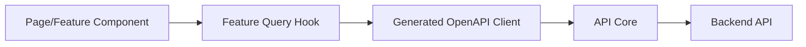
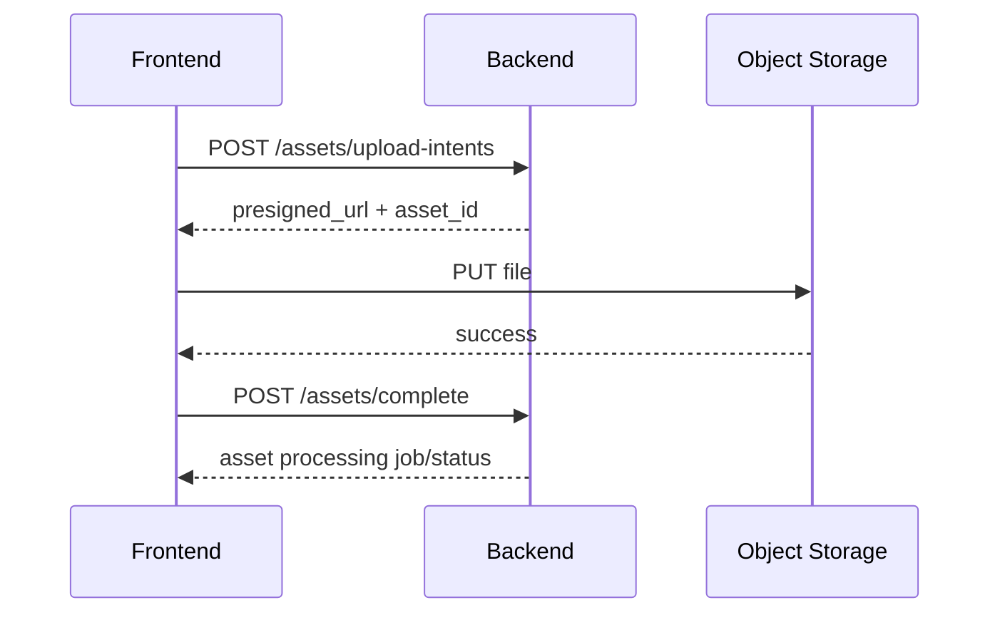

# 前端状态管理与 API 集成

## 1. 数据边界



规则：

- 页面不直接拼 URL。
- 页面不解析 `application/problem+json`。
- 页面不添加 `Authorization` 或 `X-Workspace-Id`。
- 页面不认识后端响应 Envelope。
- Feature Hook 返回适合 UI 的类型和状态。

## 2. OpenAPI Client

后端 OpenAPI 是类型事实来源。

生成流程：

```text
backend openapi.json
→ compatibility check
→ generate TypeScript client
→ frontend typecheck
→ contract tests
```

生成文件放在：

```text
src/api/generated/
```

生成目录禁止人工编辑。补充行为放在：

```text
src/api/client.ts
src/api/errors.ts
src/features/*/api.ts
```

## 3. API Core

统一负责：

- `API_BASE_URL`。
- Bearer Token。
- `X-Workspace-Id`。
- `Idempotency-Key`。
- Request ID 透传。
- 超时和取消。
- JSON/Problem Details 解析。
- 401 刷新身份或退出。
- 403 权限提示。
- 网络错误标准化。

不负责 TikHub 重试、业务任务重试、爆款评分、预算判断或后端状态机。

## 4. 身份

生产环境采用 OIDC Authorization Code + PKCE。

要求：

- Access Token 不写入 Local Storage。
- Token 优先保存在内存会话。
- 刷新机制按身份提供方安全能力实现。
- 前端不解析 Token 来代替 `/me` 权限结果。
- 401 时只允许一次受控刷新，防止请求风暴。
- 退出时清空 Query Cache、工作区 Store 和敏感表单草稿。

本地开发可以使用后端的：

```text
Bearer dev:<subject>
```

开发 Token 只能在 Local/Test 环境出现，生产构建不得提供该入口。

## 5. 工作区

工作区 ID 同时存在于：

- 路由 `/w/{workspace_id}`。
- API Header `X-Workspace-Id`。
- Query Key。

三者必须一致。不一致时：

1. 取消旧工作区未完成的浏览器请求。
2. 清理旧工作区活动 Query。
3. 切换工作台标签集合。
4. 重新加载新工作区权限和页面。

禁止只切 Header 而不切 URL。

## 6. Query Key

统一 Query Key Factory：

```ts
export const queryKeys = {
  me: ["me"] as const,
  workspaces: ["workspaces"] as const,
  trackedProfiles: {
    all: (workspaceId: string) =>
      ["workspaces", workspaceId, "tracked-profiles"] as const,
    list: (workspaceId: string, filters: TrackedProfileFilters) =>
      [
        "workspaces",
        workspaceId,
        "tracked-profiles",
        "list",
        normalizeFilters(filters),
      ] as const,
    detail: (workspaceId: string, profileId: string) =>
      [
        "workspaces",
        workspaceId,
        "tracked-profiles",
        "detail",
        profileId,
      ] as const,
  },
  jobs: {
    all: (workspaceId: string) =>
      ["workspaces", workspaceId, "jobs"] as const,
    detail: (workspaceId: string, jobId: string) =>
      ["workspaces", workspaceId, "jobs", jobId] as const,
  },
}
```

Query Key 必须包含 Query Function 使用的所有变量。

## 7. 缓存策略

| 数据 | `staleTime` 建议 | 行为 |
|---|---:|---|
| `/me` | 5 分钟 | 身份事件后失效 |
| 工作区列表 | 5 分钟 | 创建/成员变化后失效 |
| 对标账号列表 | 30–60 秒 | Mutation 后失效 |
| 对标账号详情 | 30–60 秒 | 同步完成后失效 |
| 灵感列表 | 30–60 秒 | 导入/标签/归档后失效 |
| 灵感详情 | 30 秒 | Job 完成后失效 |
| 任务详情 | 动态轮询 | 终态后停止 |
| 评分策略 | 5 分钟 | 激活新版本后失效 |
| 设置 | 5 分钟 | 保存后更新/失效 |

这些是前端缓存，不代替后端 TikHub 新鲜度策略。

## 8. Mutation 规则

### 8.1 成功失效

| Mutation | 失效 |
|---|---|
| 新建对标账号 | 对标账号列表 |
| 编辑账号 | 列表 + 详情 |
| 暂停/恢复 | 列表 + 详情 |
| 创建同步 | Job 列表 + Job 详情 |
| 导入灵感 | 灵感列表 + Job |
| 修改标签/分类 | 灵感列表 + 详情 |
| 创建选题 | 选题列表 + 灵感详情 |
| 更新脚本 | 项目详情 + 脚本版本 |
| 更新排期 | 排期 + 项目详情 |

### 8.2 乐观更新

允许：

- 本地标签增删。
- 非关键备注。
- 固定/关闭工作台标签。

谨慎或禁止：

- 产生费用的任务。
- Pause/Resume 等后端状态转换。
- 爆款评分。
- 脚本版本保存。
- 排期拖拽。
- 发布状态。

后端确认前必须显示 Pending，而不是成功。

## 9. 异步 Job

### 9.1 创建

202 响应后：

1. 把 Job 写入 Query Cache。
2. 打开或更新 Job Center。
3. 页面显示与来源操作关联的局部状态。
4. 开始轮询 Job 详情。

### 9.2 轮询

推荐动态间隔：

```ts
refetchInterval: (query) => {
  const status = query.state.data?.status
  if (!status) return false
  if (["succeeded", "failed", "dead", "cancelled"].includes(status)) {
    return false
  }
  if (status === "running") return 2_000
  if (status === "retry_wait") return 10_000
  return 5_000
}
```

要求：

- 终态停止。
- 页面不可见时降低频率或暂停非关键轮询。
- 同一 Job 只保留一份 Query。
- Job 成功后失效其影响的业务实体。
- Job 失败后保留错误，不无限自动重试。
- 用户重试必须调用后端 Retry API。

MVP 使用轮询。只有任务规模和实时性证明需要时，才增加 SSE；不先做 WebSocket。

## 10. Job 与业务实体关联

前端维护非持久映射：

```ts
type JobImpact = {
  jobId: string
  sourceRoute: string
  entityKeys: readonly QueryKey[]
  successMessage: string
}
```

例如账号同步成功后失效：

- 对标账号详情。
- 对标账号内容列表。
- 灵感库统计。
- Job 列表。

刷新页面后可从 Job 类型和 Payload 的安全摘要恢复影响范围；不能依赖纯内存映射保证正确性。

## 11. Idempotency Key

所有要求幂等的 POST：

- 用户第一次点击时生成 UUID。
- 请求进行中禁用重复提交。
- 网络重试复用同一 Key。
- 用户明确开始新操作时生成新 Key。

不要在全局 API Client 中为每次 Retry 自动生成新 Key。

## 12. Cursor Pagination

前端把 Cursor 当作不透明字符串：

- 不解析。
- 不修改。
- 不跨筛选条件复用。
- 默认使用“加载更多”或前后页。
- 无限滚动只用于内容 Feed，不用于管理表格。

为了支持浏览器后退：

- 当前筛选在 URL。
- 已加载页存在 Query Cache。
- 返回页面恢复滚动锚点。

## 13. URL 筛选

推荐流程：

```text
UI Control
→ normalize value
→ update URL
→ derive filters
→ build Query Key
→ fetch
```

不能同时在组件 State 和 URL 维护两套已提交筛选。文本搜索可以有本地输入值，防抖后提交到 URL。

## 14. 表单与未保存内容

- 服务端 DTO Schema 生成类型。
- 前端 Schema 提供即时格式校验。
- 后端错误仍是最终事实。
- 后端字段错误映射回具体字段。
- 非字段错误显示在 Submit Bar 上方。

脚本、定位和长表单：

- 离开页面前提示。
- 临时草稿只保存在本地且按工作区/实体隔离。
- 保存成功后删除草稿。
- 退出登录时清理草稿。
- 草稿不保存 Access Token 或第三方原始响应。

## 15. 版本冲突

后端返回 `VERSION_CONFLICT` 时：

- 不覆盖本地输入。
- 显示“内容已在其他位置更新”。
- 提供查看最新版。
- 提供复制本地内容。
- 脚本可生成新版本或进入差异对比。
- 排期拖拽回滚到服务器位置。

## 16. 上传



要求：

- 上传前检查类型和大小，后端再次检查。
- 显示真实上传进度。
- 可取消上传。
- 上传失败允许重试，不重复创建多个业务素材。
- 大文件不经过 Next.js Route Handler。

## 17. 错误映射

统一 `AppError`：

```ts
type AppError = {
  code: string
  title: string
  message: string
  status?: number
  requestId?: string
  retryable: boolean
  fieldErrors?: Record<string, string[]>
}
```

| 错误 | UI |
|---|---|
| `UNAUTHENTICATED` | 尝试恢复会话，否则登录 |
| `FORBIDDEN` | 权限说明，不重复重试 |
| `NOT_FOUND` | 404 页面或实体已删除 |
| `VERSION_CONFLICT` | 冲突恢复 UI |
| `JOB_ALREADY_RUNNING` | 打开已有 Job |
| `PROVIDER_RATE_LIMITED` | 显示预计重试时间 |
| `PROVIDER_UNAVAILABLE` | 保留历史数据，允许稍后重试 |
| `PROVIDER_BUDGET_EXCEEDED` | 显示预算和可恢复时间 |
| `SOURCE_CONTENT_UNAVAILABLE` | 标记来源不可见 |

## 18. Null 与零

- `null`：`—`，表示平台未提供或尚未获得。
- `0`：显示 `0`，表示确认是零。
- Pending：Skeleton 或“正在获取”。
- Error：保留旧值并显示“更新失败”。
- Stale：显示最后更新时间。

不能用 `value || 0` 处理指标。

## 19. Store 持久化

Workbench Store 只持久化：

- 打开标签。
- 固定标签。
- 侧边栏展开状态。
- 列表视图偏好。
- 最近工作区。

Key 必须包含用户和工作区：

```text
social-ops:{user_id}:{workspace_id}:workbench
```

不持久化：

- Access Token。
- 后端实体。
- Provider 原始数据。
- API 错误全文。
- 上传预签名 URL。

## 20. 可观测性

前端事件至少包括：

- 页面加载失败。
- API 错误码。
- Request ID。
- Job 创建到完成耗时。
- 前端未捕获异常。
- OpenAPI Client 版本。

不上传 Token、TikHub Key、完整脚本、逐字稿、用户文件或 Provider 原始响应。

